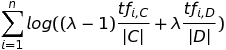

# andsports-ir
Draft collection of Information Retrieval implementations
for the andsports profile search.

## IR implementations
This collection includes drafts for the following IR techniques:

### [Query likelihood model](https://en.wikipedia.org/wiki/Query_likelihood_model)

The implementation is inspired by [the estimation of the query generation probability](https://nlp.stanford.edu/IR-book/html/htmledition/estimating-the-query-generation-probability-1.html)
as described in [Introduction to Information Retrieval](https://nlp.stanford.edu/IR-book/) (Christopher D. Manning, Prabhakar Raghavan and Hinrich Schütze, 2008).
However, for better presentation and to prevent numerical underflow we take the averaged exponential of the sum of log likelihoods for each query term instead of calculating the product of their probabilities. 
Given the rather short and incoherent profile text snippets, the model uses Maximum Likelihood Estimation based on a unigram language model: 

Where 
* tf (i, C) is the frequency of the i-th query term in the whole collection, 
* |C| is the length (number of words) of the collection,
* tf (i, D) is the frequency of the i-th query term in the document (profile text snippet)
* |D| is the length of the document
* λ is the smoothing factor

Feel free to check some [sample queries and their results](query_likelihood_results.md).
<!-- 
http://www.sciweavers.org/free-online-latex-equation-editor
-->

## Outlook
During the next pandemic crisis I´ll find a moment to implement andsports profile retrieval using [Latent Semantic Indexing](https://nlp.stanford.edu/IR-book/html/htmledition/latent-semantic-indexing-1.html) 
(See also [Latent semantic analysis](https://en.wikipedia.org/wiki/Latent_semantic_analysis))
 

## Requirements
* Python 3.6 or higher
* Specific package dependencies: nltk, pickle, pandas
* DB exports need to be saved in tab-separated, UTF-8 encoded CSV files for pre-processing.

## Usage
To run any of the python scripts:
1) Open a command prompt
2) Change to the directory of the corresponding script file
3) Type `python <script file>.py` (This will also explain the usage in case
specific parameters are required)
4) Press `enter`

## Limitations/ TODOs
* No test coverage
* Optimize SQL queries for profile information retrieval to include/concatenate profile name, sports and locations relevant for each profile
* Make code for data export processing configurable (define relevant csv header columns, allow concatenation of value fields, etc.).
* Implement proper exception handling

